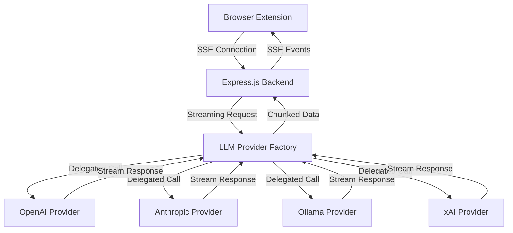

# Streaming Function Implementation Guide

**Project:** Blamewriter - Bitbucket PR Description Generator  
**Document:** Streaming Implementation Specification  
**Version:** 1.0  
**Date:** 2025-06-21

## 📋 Table of Contents

1. [Overview](#overview)
2. [Architecture Design](#architecture-design)
3. [Backend Implementation](#backend-implementation)
4. [Frontend Implementation](#frontend-implementation)
5. [Protocol Specification](#protocol-specification)
6. [Error Handling](#error-handling)
7. [Security Considerations](#security-considerations)
8. [Performance Optimization](#performance-optimization)
9. [Testing Strategy](#testing-strategy)
10. [Migration Guide](#migration-guide)
11. [Troubleshooting](#troubleshooting)

## 🌟 Overview

### What is Streaming?

Streaming allows the application to display LLM responses in real-time as they are generated, rather than waiting for the complete response. This provides:

- **Better User Experience**: Users see immediate feedback
- **Perceived Performance**: Responses feel faster
- **Interactive Feedback**: Users can stop generation early if needed
- **Large Response Handling**: Better handling of long descriptions

### Current vs. Streaming Architecture

**Current (Blocking):**
```
Frontend → Backend → LLM Provider → Complete Response → Frontend
```

**Streaming:**
```
Frontend ← Backend ← LLM Provider (chunk 1)
Frontend ← Backend ← LLM Provider (chunk 2)
Frontend ← Backend ← LLM Provider (chunk 3)
...
Frontend ← Backend ← LLM Provider (final chunk)
```

## 🏗️ Architecture Design

### System Components



### Key Technologies

- **Backend**: Server-Sent Events (SSE) for streaming
- **LLM Integration**: LangChain streaming capabilities
- **Frontend**: EventSource API for receiving streams
- **Protocol**: HTTP/1.1 with SSE + JSON for structured data

## 🔧 Backend Implementation

### 1. Streaming Route Implementation

Create a new streaming endpoint in the backend:

```typescript
// backend/src/routes/generate-v2-stream.ts

import express from 'express';
import { LLMProviderFactory } from '../services/llm-provider';

interface StreamingGenerateRequest {
  prUrl: string;
  bitbucketToken: string;
  llmConfig: {
    providerId: string;
    modelId: string;
    apiKey?: string;
    customEndpoint?: string;
  };
  template: {
    content: string;
    id?: string;
  };
  requestId: string; // For tracking this specific request
}

/**
 * POST /api/v2/generate/stream
 * Streaming version of the generate endpoint
 */
router.post('/stream', async (req: express.Request, res: express.Response) => {
  const request = req.body as StreamingGenerateRequest;
  
  // Set SSE headers
  res.writeHead(200, {
    'Content-Type': 'text/event-stream',
    'Cache-Control': 'no-cache',
    'Connection': 'keep-alive',
    'Access-Control-Allow-Origin': '*',
    'Access-Control-Allow-Headers': 'Cache-Control'
  });

  // Send initial status
  sendSSEEvent(res, 'status', { 
    phase: 'initializing', 
    message: 'Starting PR analysis...',
    requestId: request.requestId
  });

  try {
    // 1. Parse PR URL and validate
    const urlInfo = parseBitbucketPRUrl(request.prUrl);
    sendSSEEvent(res, 'status', { 
      phase: 'fetching_pr_data', 
      message: 'Fetching PR data from Bitbucket...' 
    });

    // 2. Fetch PR data
    const bitbucketClient = createBitbucketClient(request.bitbucketToken);
    const prData = await fetchPRData(bitbucketClient, urlInfo);
    
    sendSSEEvent(res, 'pr_data', { 
      title: prData.title,
      diffStats: prData.diffStats 
    });

    // 3. Initialize LLM provider
    sendSSEEvent(res, 'status', { 
      phase: 'initializing_llm', 
      message: 'Initializing LLM provider...' 
    });

    const provider = LLMProviderFactory.create(
      request.llmConfig.providerId,
      request.llmConfig
    );

    // 4. Start streaming generation
    sendSSEEvent(res, 'status', { 
      phase: 'generating', 
      message: 'Generating description...' 
    });

    await streamLLMGeneration(res, provider, prData, request.template);

    // 5. Send completion event
    sendSSEEvent(res, 'complete', { 
      message: 'Generation completed successfully' 
    });

  } catch (error) {
    sendSSEEvent(res, 'error', {
      code: 'GENERATION_FAILED',
      message: error.message,
      retryable: true
    });
  } finally {
    res.end();
  }
});

function sendSSEEvent(res: express.Response, type: string, data: any) {
  res.write(`event: ${type}\n`);
  res.write(`data: ${JSON.stringify(data)}\n\n`);
}
```

### 2. Enhanced LLM Provider Base Class

Extend the existing `BaseLLMProvider` to support streaming:

```typescript
// backend/src/services/llm-provider.ts

export abstract class BaseLLMProvider {
  // ...existing code...

  /**
   * Stream-enabled PR description generation
   */
  async *generatePRDescriptionStream(
    diffContent: string,
    options: GenerateDescriptionOptions = {}
  ): AsyncGenerator<StreamChunk, void, unknown> {
    const opts = { ...DEFAULT_GENERATION_OPTIONS, ...options };
    
    // Truncate diff if necessary
    const { truncated: processedDiff, wasTruncated } = this.truncateDiff(
      diffContent,
      opts.diffSizeLimit
    );

    if (wasTruncated) {
      yield {
        type: 'metadata',
        data: {
          diffTruncated: true,
          originalSize: diffContent.length,
          truncatedSize: processedDiff.length
        }
      };
    }

    // Process template
    const template = opts.template || this.getDefaultPromptTemplate();
    let prompt: string;
    
    if (opts.templateData) {
      const finalTemplateData = { ...opts.templateData, DIFF_CONTENT: processedDiff };
      prompt = this.processTemplate(template, finalTemplateData);
    } else {
      prompt = template.replace(/{DIFF_CONTENT}/g, processedDiff);
    }

    yield {
      type: 'metadata',
      data: {
        promptGenerated: true,
        promptLength: prompt.length,
        model: opts.model
      }
    };

    // Stream the actual LLM generation
    yield* this.executeStreamingLLMGeneration(prompt, options);
  }

  /**
   * Abstract method for streaming LLM generation
   * Each provider must implement this
   */
  protected abstract executeStreamingLLMGeneration(
    prompt: string,
    options?: GenerateDescriptionOptions
  ): AsyncGenerator<StreamChunk, void, unknown>;
}

export interface StreamChunk {
  type: 'metadata' | 'content' | 'complete' | 'error';
  data: any;
  timestamp?: string;
}
```

### 3. Provider-Specific Streaming Implementations

#### OpenAI Provider Streaming

```typescript
// backend/src/services/providers/openai-provider.ts

export class OpenAIProvider extends BaseLLMProvider {
  // ...existing code...

  protected async *executeStreamingLLMGeneration(
    prompt: string,
    options?: GenerateDescriptionOptions
  ): AsyncGenerator<StreamChunk, void, unknown> {
    const opts = { ...DEFAULT_GENERATION_OPTIONS, ...options };

    // Update client for streaming
    const streamingClient = new ChatOpenAI({
      openAIApiKey: this.openaiConfig.apiKey,
      model: opts.model,
      temperature: opts.temperature || 0.7,
      maxTokens: opts.maxTokens,
      streaming: true, // Enable streaming
      ...this.openaiConfig.timeout && { timeout: this.openaiConfig.timeout },
      ...this.openaiConfig.organizationId && { 
        organization: this.openaiConfig.organizationId 
      },
    });

    let accumulatedContent = '';
    let tokenCount = 0;

    try {
      const stream = await streamingClient.stream([new HumanMessage(prompt)]);
      
      for await (const chunk of stream) {
        if (chunk.content) {
          const content = chunk.content as string;
          accumulatedContent += content;
          tokenCount++;

          yield {
            type: 'content',
            data: {
              chunk: content,
              accumulated: accumulatedContent,
              tokenCount: tokenCount
            },
            timestamp: new Date().toISOString()
          };
        }
      }

      // Send final metadata
      yield {
        type: 'complete',
        data: {
          totalTokens: tokenCount,
          finalContent: accumulatedContent,
          model: opts.model,
          provider: LLMProviderType.OPENAI
        }
      };

    } catch (error) {
      yield {
        type: 'error',
        data: {
          error: this.transformError(error),
          provider: LLMProviderType.OPENAI
        }
      };
    }
  }
}
```

#### Anthropic Provider Streaming

```typescript
// backend/src/services/providers/anthropic-provider.ts

export class AnthropicProvider extends BaseLLMProvider {
  // ...existing code...

  protected async *executeStreamingLLMGeneration(
    prompt: string,
    options?: GenerateDescriptionOptions
  ): AsyncGenerator<StreamChunk, void, unknown> {
    const opts = { ...DEFAULT_GENERATION_OPTIONS, ...options };

    const streamingClient = new ChatAnthropic({
      anthropicApiKey: this.anthropicConfig.apiKey,
      model: opts.model,
      temperature: opts.temperature || 0.7,
      maxTokens: opts.maxTokens,
      streaming: true, // Enable streaming
      maxRetries: this.anthropicConfig.maxRetries || 3,
      ...this.anthropicConfig.baseUrl && { baseURL: this.anthropicConfig.baseUrl },
    });

    let accumulatedContent = '';
    let tokenCount = 0;

    try {
      const stream = await streamingClient.stream([new HumanMessage(prompt)]);
      
      for await (const chunk of stream) {
        if (chunk.content) {
          const content = chunk.content as string;
          accumulatedContent += content;
          tokenCount++;

          yield {
            type: 'content',
            data: {
              chunk: content,
              accumulated: accumulatedContent,
              tokenCount: tokenCount
            },
            timestamp: new Date().toISOString()
          };
        }
      }

      // Send completion metadata
      yield {
        type: 'complete',
        data: {
          totalTokens: tokenCount,
          finalContent: accumulatedContent,
          model: opts.model,
          provider: LLMProviderType.ANTHROPIC
        }
      };

    } catch (error) {
      yield {
        type: 'error',
        data: {
          error: this.transformError(error),
          provider: LLMProviderType.ANTHROPIC
        }
      };
    }
  }
}
```

#### xAI Provider Streaming

```typescript
// backend/src/services/providers/xai-provider.ts

export class XAIProvider extends BaseLLMProvider {
  // ...existing code...

  protected async *executeStreamingLLMGeneration(
    prompt: string,
    options?: GenerateDescriptionOptions
  ): AsyncGenerator<StreamChunk, void, unknown> {
    const opts = { ...DEFAULT_GENERATION_OPTIONS, ...options };

    try {
      const response = await this.client.post('/chat/completions', {
        model: opts.model,
        messages: [{ role: 'user', content: prompt }],
        max_tokens: opts.maxTokens,
        temperature: opts.temperature,
        stream: true, // Enable streaming
      }, {
        responseType: 'stream'
      });

      let accumulatedContent = '';
      let tokenCount = 0;

      response.data.on('data', (chunk: Buffer) => {
        const lines = chunk.toString().split('\n');
        
        for (const line of lines) {
          if (line.startsWith('data: ')) {
            const data = line.slice(6);
            
            if (data === '[DONE]') {
              return;
            }

            try {
              const parsed = JSON.parse(data);
              const content = parsed.choices?.[0]?.delta?.content;
              
              if (content) {
                accumulatedContent += content;
                tokenCount++;

                // This would need to be handled differently in real implementation
                // as we can't yield from inside a callback
                this.emitStreamChunk({
                  type: 'content',
                  data: {
                    chunk: content,
                    accumulated: accumulatedContent,
                    tokenCount: tokenCount
                  },
                  timestamp: new Date().toISOString()
                });
              }
            } catch (parseError) {
              console.warn('Failed to parse SSE data:', parseError);
            }
          }
        }
      });

      response.data.on('end', () => {
        this.emitStreamChunk({
          type: 'complete',
          data: {
            totalTokens: tokenCount,
            finalContent: accumulatedContent,
            model: opts.model,
            provider: LLMProviderType.XAI
          }
        });
      });

    } catch (error) {
      yield {
        type: 'error',
        data: {
          error: this.transformError(error),
          provider: LLMProviderType.XAI
        }
      };
    }
  }

  // Helper method for xAI's callback-based streaming
  private emitStreamChunk(chunk: StreamChunk) {
    // This is a simplified example - real implementation would need
    // proper async generator handling for callback-based APIs
  }
}
```

#### Ollama Provider Streaming

```typescript
// backend/src/services/providers/ollama-provider.ts

export class OllamaProvider extends BaseLLMProvider {
  // ...existing code...

  protected async *executeStreamingLLMGeneration(
    prompt: string,
    options?: GenerateDescriptionOptions
  ): AsyncGenerator<StreamChunk, void, unknown> {
    const opts = { ...DEFAULT_GENERATION_OPTIONS, ...options };

    // Configure streaming client
    const streamingClient = new Ollama({
      baseUrl: this.ollamaConfig.baseUrl || 'http://localhost:11434',
      model: opts.model,
      temperature: opts.temperature || 0.7,
      numCtx: opts.maxTokens || 1000,
      streaming: true // Enable streaming
    });

    let accumulatedContent = '';
    let tokenCount = 0;

    try {
      const stream = await streamingClient.stream(prompt);
      
      for await (const chunk of stream) {
        if (chunk) {
          const content = chunk.toString();
          accumulatedContent += content;
          tokenCount++;

          yield {
            type: 'content',
            data: {
              chunk: content,
              accumulated: accumulatedContent,
              tokenCount: tokenCount
            },
            timestamp: new Date().toISOString()
          };
        }
      }

      yield {
        type: 'complete',
        data: {
          totalTokens: tokenCount,
          finalContent: accumulatedContent,
          model: opts.model,
          provider: LLMProviderType.OLLAMA
        }
      };

    } catch (error) {
      yield {
        type: 'error',
        data: {
          error: this.transformError(error),
          provider: LLMProviderType.OLLAMA
        }
      };
    }
  }
}
```

### 4. Streaming Route Helper Functions

```typescript
// backend/src/routes/streaming-helpers.ts

async function streamLLMGeneration(
  res: express.Response,
  provider: BaseLLMProvider,
  prData: any,
  template: { content: string; id?: string }
): Promise<void> {
  const templateData = {
    PR_TITLE: prData.title,
    PR_DESCRIPTION: prData.description || '',
    SOURCE_BRANCH: prData.sourceBranch,
    TARGET_BRANCH: prData.targetBranch,
    AUTHOR: prData.author,
    DIFF_CONTENT: prData.diff
  };

  const options: GenerateDescriptionOptions = {
    template: template.content,
    templateData: templateData,
    model: 'default' // This should come from request
  };

  try {
    const stream = provider.generatePRDescriptionStream(prData.diff, options);
    
    for await (const chunk of stream) {
      switch (chunk.type) {
        case 'metadata':
          sendSSEEvent(res, 'metadata', chunk.data);
          break;
          
        case 'content':
          sendSSEEvent(res, 'content', chunk.data);
          break;
          
        case 'complete':
          sendSSEEvent(res, 'llm_complete', chunk.data);
          break;
          
        case 'error':
          sendSSEEvent(res, 'error', chunk.data);
          return;
      }
    }
  } catch (error) {
    sendSSEEvent(res, 'error', {
      code: 'STREAMING_ERROR',
      message: error.message,
      retryable: false
    });
  }
}

async function fetchPRData(client: any, urlInfo: any) {
  const prInfo = await client.fetchPRInfo(urlInfo);
  const prDiff = await client.fetchPRDiff(urlInfo);
  
  return {
    ...prInfo,
    diff: prDiff,
    diffStats: calculateDiffStats(prDiff)
  };
}

function calculateDiffStats(diff: string) {
  const lines = diff.split('\n');
  let addedLines = 0;
  let deletedLines = 0;
  
  for (const line of lines) {
    if (line.startsWith('+') && !line.startsWith('+++')) {
      addedLines++;
    } else if (line.startsWith('-') && !line.startsWith('---')) {
      deletedLines++;
    }
  }
  
  return { addedLines, deletedLines, totalLines: lines.length };
}
```

## 🎨 Frontend Implementation

### 1. Streaming API Client

Create a streaming client in the browser extension:

```typescript
// frontend/src/common/streaming_client.ts

export interface StreamingResponse {
  onStatus?: (status: StatusEvent) => void;
  onPRData?: (data: PRDataEvent) => void;
  onMetadata?: (metadata: MetadataEvent) => void;
  onContent?: (content: ContentEvent) => void;
  onComplete?: (result: CompleteEvent) => void;
  onError?: (error: ErrorEvent) => void;
}

export interface StatusEvent {
  phase: 'initializing' | 'fetching_pr_data' | 'initializing_llm' | 'generating';
  message: string;
  requestId?: string;
}

export interface PRDataEvent {
  title: string;
  diffStats: {
    addedLines: number;
    deletedLines: number;
    totalLines: number;
  };
}

export interface MetadataEvent {
  diffTruncated?: boolean;
  originalSize?: number;
  truncatedSize?: number;
  promptGenerated?: boolean;
  promptLength?: number;
  model?: string;
}

export interface ContentEvent {
  chunk: string;
  accumulated: string;
  tokenCount: number;
}

export interface CompleteEvent {
  totalTokens: number;
  finalContent: string;
  model: string;
  provider: string;
}

export interface ErrorEvent {
  code: string;
  message: string;
  retryable: boolean;
}

export class StreamingAPIClient {
  private readonly baseUrl: string;
  private eventSource: EventSource | null = null;
  private abortController: AbortController | null = null;

  constructor(baseUrl: string = 'http://localhost:3001') {
    this.baseUrl = baseUrl;
  }

  async generateDescription(
    request: StreamingGenerateRequest,
    handlers: StreamingResponse
  ): Promise<void> {
    // Generate unique request ID
    const requestId = crypto.randomUUID();
    const requestWithId = { ...request, requestId };

    try {
      // First, make POST request to initiate streaming
      const response = await fetch(`${this.baseUrl}/api/v2/generate/stream`, {
        method: 'POST',
        headers: {
          'Content-Type': 'application/json',
        },
        body: JSON.stringify(requestWithId),
      });

      if (!response.ok) {
        throw new Error(`HTTP ${response.status}: ${response.statusText}`);
      }

      // Create EventSource for the streaming endpoint
      const streamUrl = `${this.baseUrl}/api/v2/generate/stream/${requestId}`;
      this.eventSource = new EventSource(streamUrl);

      // Set up event listeners
      this.setupEventListeners(handlers);

    } catch (error) {
      handlers.onError?.({
        code: 'CONNECTION_FAILED',
        message: error instanceof Error ? error.message : 'Unknown error',
        retryable: true
      });
    }
  }

  private setupEventListeners(handlers: StreamingResponse): void {
    if (!this.eventSource) return;

    this.eventSource.addEventListener('status', (event) => {
      const data = JSON.parse(event.data) as StatusEvent;
      handlers.onStatus?.(data);
    });

    this.eventSource.addEventListener('pr_data', (event) => {
      const data = JSON.parse(event.data) as PRDataEvent;
      handlers.onPRData?.(data);
    });

    this.eventSource.addEventListener('metadata', (event) => {
      const data = JSON.parse(event.data) as MetadataEvent;
      handlers.onMetadata?.(data);
    });

    this.eventSource.addEventListener('content', (event) => {
      const data = JSON.parse(event.data) as ContentEvent;
      handlers.onContent?.(data);
    });

    this.eventSource.addEventListener('llm_complete', (event) => {
      const data = JSON.parse(event.data) as CompleteEvent;
      handlers.onComplete?.(data);
    });

    this.eventSource.addEventListener('complete', (event) => {
      this.close();
    });

    this.eventSource.addEventListener('error', (event) => {
      const data = JSON.parse(event.data) as ErrorEvent;
      handlers.onError?.(data);
      this.close();
    });

    // Handle connection errors
    this.eventSource.onerror = (event) => {
      handlers.onError?.({
        code: 'CONNECTION_ERROR',
        message: 'Lost connection to server',
        retryable: true
      });
      this.close();
    };
  }

  abort(): void {
    this.close();
  }

  private close(): void {
    if (this.eventSource) {
      this.eventSource.close();
      this.eventSource = null;
    }
    if (this.abortController) {
      this.abortController.abort();
      this.abortController = null;
    }
  }
}

export interface StreamingGenerateRequest {
  prUrl: string;
  bitbucketToken: string;
  llmConfig: {
    providerId: string;
    modelId: string;
    apiKey?: string;
    customEndpoint?: string;
  };
  template: {
    content: string;
    id?: string;
  };
}
```

### 2. Enhanced Background Script

Update the background script to handle streaming:

```typescript
// frontend/src/background/background.ts

import { StreamingAPIClient, StreamingResponse } from '../common/streaming_client';

class BackgroundService {
  private streamingClient: StreamingAPIClient;
  private activeStreams: Map<string, StreamingAPIClient> = new Map();

  constructor() {
    this.streamingClient = new StreamingAPIClient();
    this.setupMessageListener();
  }

  private async handleGenerateStreamingRequest(
    request: GenerateStreamingRequest
  ): Promise<GenerateStreamingResponse> {
    const streamId = crypto.randomUUID();

    try {
      // Get OAuth token
      const accessToken = await this.getValidAccessTokenWithRefresh();
      if (!accessToken) {
        return {
          success: false,
          error: 'Authentication required. Please authenticate with Bitbucket first.'
        };
      }

      // Create streaming client for this request
      const client = new StreamingAPIClient();
      this.activeStreams.set(streamId, client);

      // Set up handlers to relay events to content script
      const handlers: StreamingResponse = {
        onStatus: (status) => {
          this.relayToContentScript('streaming_status', { streamId, ...status });
        },
        onPRData: (data) => {
          this.relayToContentScript('streaming_pr_data', { streamId, ...data });
        },
        onMetadata: (metadata) => {
          this.relayToContentScript('streaming_metadata', { streamId, ...metadata });
        },
        onContent: (content) => {
          this.relayToContentScript('streaming_content', { streamId, ...content });
        },
        onComplete: (result) => {
          this.relayToContentScript('streaming_complete', { streamId, ...result });
          this.activeStreams.delete(streamId);
        },
        onError: (error) => {
          this.relayToContentScript('streaming_error', { streamId, ...error });
          this.activeStreams.delete(streamId);
        }
      };

      // Start streaming
      await client.generateDescription({
        prUrl: request.prUrl,
        bitbucketToken: accessToken,
        llmConfig: request.llmConfig,
        template: request.template
      }, handlers);

      return {
        success: true,
        streamId: streamId
      };

    } catch (error) {
      this.activeStreams.delete(streamId);
      return {
        success: false,
        error: error instanceof Error ? error.message : 'Unknown error'
      };
    }
  }

  private relayToContentScript(type: string, data: any): void {
    // Send to all tabs that might be listening
    chrome.tabs.query({ active: true, currentWindow: true }, (tabs) => {
      tabs.forEach(tab => {
        if (tab.id) {
          chrome.tabs.sendMessage(tab.id, {
            action: type,
            data: data
          }).catch(() => {
            // Tab might not have content script loaded, ignore
          });
        }
      });
    });
  }

  abortStream(streamId: string): void {
    const client = this.activeStreams.get(streamId);
    if (client) {
      client.abort();
      this.activeStreams.delete(streamId);
    }
  }
}
```

### 3. Enhanced Content Script

Update the content script to handle streaming responses:

```typescript
// frontend/src/content/content.ts

interface StreamingState {
  streamId: string | null;
  isStreaming: boolean;
  accumulatedContent: string;
  currentPhase: string;
}

let streamingState: StreamingState = {
  streamId: null,
  isStreaming: false,
  accumulatedContent: '',
  currentPhase: ''
};

function createStreamingGenerateClickHandler(template: Template, llmConfig: UserLLMConfig) {
  return async () => {
    if (!aiButton || streamingState.isStreaming) {
      return;
    }

    const originalContent = aiButton.innerHTML;
    streamingState.isStreaming = true;
    streamingState.accumulatedContent = '';

    // Create abort button
    const abortButton = createAbortButton();
    addAbortButton(abortButton);

    try {
      const request: GenerateStreamingRequest = {
        action: 'generate_description_streaming',
        prUrl: window.location.href,
        template: template,
        llmConfig: llmConfig,
      };

      const response = await sendMessageToBackground<GenerateStreamingResponse>(request);

      if (!response.success) {
        throw new Error(response.error || 'Failed to start streaming');
      }

      streamingState.streamId = response.streamId;
      updateAiButtonState({ 
        enabled: false, 
        text: 'Initializing...', 
        title: 'AI is starting to process your request...' 
      });

    } catch (error) {
      console.error('[BPR-Helper] Streaming failed:', error);
      handleStreamingError(error);
    }
  };
}

function createAbortButton(): HTMLButtonElement {
  const button = document.createElement('button');
  button.id = 'bpr-abort-button';
  button.className = 'bpr-abort-button';
  button.innerHTML = '<span class="icon">⏹️</span><span class="text">Stop</span>';
  button.title = 'Stop generation';
  button.onclick = abortStreaming;
  return button;
}

function addAbortButton(abortButton: HTMLButtonElement): void {
  if (aiButton?.parentNode) {
    aiButton.parentNode.insertBefore(abortButton, aiButton.nextSibling);
  }
}

function removeAbortButton(): void {
  const abortButton = document.getElementById('bpr-abort-button');
  if (abortButton) {
    abortButton.remove();
  }
}

function abortStreaming(): void {
  if (streamingState.streamId) {
    sendMessageToBackground({
      action: 'abort_streaming',
      streamId: streamingState.streamId
    });
  }
  resetStreamingState();
}

function resetStreamingState(): void {
  streamingState.isStreaming = false;
  streamingState.streamId = null;
  streamingState.accumulatedContent = '';
  streamingState.currentPhase = '';
  
  removeAbortButton();
  updateAiButtonState({ 
    enabled: true, 
    text: 'AI 生成描述', 
    title: '點擊以生成 PR 描述' 
  });
}

// Enhanced message listener for streaming events
function setupStreamingMessageListener(): void {
  chrome.runtime.onMessage.addListener((message, sender, sendResponse) => {
    if (!message.action.startsWith('streaming_')) {
      return;
    }

    const { streamId, ...data } = message.data;
    
    // Only process messages for our current stream
    if (streamId !== streamingState.streamId) {
      return;
    }

    switch (message.action) {
      case 'streaming_status':
        handleStreamingStatus(data);
        break;
      case 'streaming_pr_data':
        handleStreamingPRData(data);
        break;
      case 'streaming_metadata':
        handleStreamingMetadata(data);
        break;
      case 'streaming_content':
        handleStreamingContent(data);
        break;
      case 'streaming_complete':
        handleStreamingComplete(data);
        break;
      case 'streaming_error':
        handleStreamingError(data);
        break;
    }
  });
}

function handleStreamingStatus(data: StatusEvent): void {
  streamingState.currentPhase = data.phase;
  
  const phaseMessages = {
    initializing: 'Initializing...',
    fetching_pr_data: 'Fetching PR data...',
    initializing_llm: 'Preparing AI...',
    generating: 'Generating...'
  };

  updateAiButtonState({ 
    enabled: false, 
    text: phaseMessages[data.phase] || 'Processing...', 
    title: data.message 
  });
}

function handleStreamingPRData(data: PRDataEvent): void {
  console.log('[BPR-Helper] PR Data received:', data);
  // Could show PR stats to user
}

function handleStreamingMetadata(data: MetadataEvent): void {
  console.log('[BPR-Helper] Metadata received:', data);
  
  if (data.diffTruncated) {
    updateAiButtonState({ 
      enabled: false, 
      text: 'Processing large diff...', 
      title: `Diff truncated: ${data.originalSize} → ${data.truncatedSize} chars` 
    });
  }
}

function handleStreamingContent(data: ContentEvent): void {
  streamingState.accumulatedContent = data.accumulated;
  
  // Update the editor in real-time
  fillDescriptionIntoEditor(streamingState.accumulatedContent);
  
  // Update button with progress
  updateAiButtonState({ 
    enabled: false, 
    text: `Generating... (${data.tokenCount} tokens)`, 
    title: 'AI is writing the description...' 
  });
}

function handleStreamingComplete(data: CompleteEvent): void {
  console.log('[BPR-Helper] Generation completed:', data);
  
  // Ensure final content is in editor
  fillDescriptionIntoEditor(data.finalContent);
  
  // Show completion message briefly
  updateAiButtonState({ 
    enabled: false, 
    text: `✅ Complete (${data.totalTokens} tokens)`, 
    title: 'Description generated successfully!' 
  });

  // Reset after a short delay
  setTimeout(() => {
    resetStreamingState();
  }, 2000);
}

function handleStreamingError(error: ErrorEvent | Error): void {
  console.error('[BPR-Helper] Streaming error:', error);
  
  const message = error instanceof Error ? error.message : error.message;
  const retryable = error instanceof Error ? false : error.retryable;
  
  updateAiButtonState({ 
    enabled: false, 
    text: '❌ Error', 
    title: `Generation failed: ${message}` 
  });

  alert(`生成描述失敗：\n${message}${retryable ? '\n\n可以嘗試重新生成。' : ''}`);

  setTimeout(() => {
    resetStreamingState();
  }, 3000);
}

// Add real-time editor filling with typewriter effect
function fillDescriptionIntoEditorRealtime(content: string): void {
  if (!currentEditorElement) {
    return;
  }

  // Use the same filling logic but update gradually
  currentEditorElement.focus();
  
  const html = `<p>${content
    .replace(/\n\n/g, '</p><p>')
    .replace(/\n/g, '<br>')}</p>`;

  const selection = window.getSelection();
  if (!selection) return;

  selection.removeAllRanges();
  const range = document.createRange();
  range.selectNodeContents(currentEditorElement);
  range.collapse(true);
  selection.addRange(range);

  // Clear existing content
  currentEditorElement.innerHTML = '';
  
  // Insert new content
  const fragment = range.createContextualFragment(html);
  range.insertNode(fragment);

  // Move cursor to end
  selection.removeAllRanges();
  range.selectNodeContents(currentEditorElement);
  range.collapse(false);
  selection.addRange(range);
}

// Update the main initialization to include streaming
function setupMessageListenerFromPopup(): void {
  setupStreamingMessageListener();
  
  // Keep existing non-streaming message listener
  chrome.runtime.onMessage.addListener((request: FillDescriptionRequest, sender, sendResponse) => {
    if (request.action === 'fillDescription') {
      if (currentEditorElement) {
        fillDescriptionIntoEditor(request.description);
        sendResponse({ success: true });
      } else {
        sendResponse({ success: false, error: 'Editor not found on the page.' });
      }
    }
  });
}
```

## 📡 Protocol Specification

### SSE Event Types

```typescript
// Event type definitions
interface SSEEventTypes {
  // Status updates
  'status': StatusEvent;
  
  // PR data received
  'pr_data': PRDataEvent;
  
  // Generation metadata
  'metadata': MetadataEvent;
  
  // Content chunks
  'content': ContentEvent;
  
  // LLM completion
  'llm_complete': CompleteEvent;
  
  // Overall completion
  'complete': CompleteEvent;
  
  // Errors
  'error': ErrorEvent;
}
```

### SSE Event Format

```
event: status
data: {"phase": "initializing", "message": "Starting PR analysis..."}

event: pr_data
data: {"title": "Fix user authentication bug", "diffStats": {"addedLines": 45, "deletedLines": 12}}

event: metadata
data: {"promptGenerated": true, "promptLength": 1250, "model": "gpt-4"}

event: content
data: {"chunk": "This PR addresses", "accumulated": "This PR addresses", "tokenCount": 3}

event: content
data: {"chunk": " a critical bug", "accumulated": "This PR addresses a critical bug", "tokenCount": 6}

event: llm_complete
data: {"totalTokens": 150, "finalContent": "...", "model": "gpt-4", "provider": "openai"}

event: complete
data: {"message": "Generation completed successfully"}
```

## 🛡️ Error Handling

### Error Categories

1. **Connection Errors**: Network issues, server unavailable
2. **Authentication Errors**: Invalid tokens, expired sessions
3. **Validation Errors**: Invalid request parameters
4. **Provider Errors**: LLM API issues, rate limits
5. **Processing Errors**: Streaming interrupted, parsing failures

### Error Recovery Strategies

```typescript
// Error recovery implementation
class StreamingErrorHandler {
  private retryAttempts = 0;
  private maxRetries = 3;
  private retryDelay = 1000; // Start with 1 second

  async handleError(error: ErrorEvent, context: StreamingContext): Promise<void> {
    console.error('[Streaming] Error occurred:', error);

    switch (error.code) {
      case 'CONNECTION_ERROR':
        if (this.retryAttempts < this.maxRetries) {
          await this.retryWithBackoff(context);
        } else {
          this.showFinalError('Connection failed after multiple attempts');
        }
        break;

      case 'RATE_LIMITED':
        const retryAfter = error.retryAfter || 60000; // Default 1 minute
        await this.delayedRetry(context, retryAfter);
        break;

      case 'AUTHENTICATION_ERROR':
        await this.reauthenticate(context);
        break;

      case 'PROVIDER_UNAVAILABLE':
        this.suggestAlternativeProvider(context);
        break;

      default:
        this.showError(error.message, error.retryable);
    }
  }

  private async retryWithBackoff(context: StreamingContext): Promise<void> {
    this.retryAttempts++;
    const delay = this.retryDelay * Math.pow(2, this.retryAttempts - 1);
    
    console.log(`[Streaming] Retrying in ${delay}ms (attempt ${this.retryAttempts}/${this.maxRetries})`);
    
    await new Promise(resolve => setTimeout(resolve, delay));
    await context.retry();
  }

  private async delayedRetry(context: StreamingContext, delay: number): Promise<void> {
    console.log(`[Streaming] Rate limited, retrying in ${delay}ms`);
    await new Promise(resolve => setTimeout(resolve, delay));
    await context.retry();
  }
}
```

## 🔒 Security Considerations

### Authentication

- OAuth tokens are transmitted securely
- Streaming endpoints require valid authentication
- Token refresh is handled automatically

### Data Protection

- PR content is not logged or stored
- Streaming is done over HTTPS
- API keys are never exposed to client

### Resource Protection

```typescript
// Rate limiting for streaming endpoints
const streamingRateLimit = {
  windowMs: 15 * 60 * 1000, // 15 minutes
  max: 10, // Limit each IP to 10 streaming requests per windowMs
  message: {
    error: {
      code: 'RATE_LIMITED',
      message: 'Too many streaming requests',
      retryAfter: 900000 // 15 minutes
    }
  }
};

app.use('/api/v2/generate/stream', streamingRateLimit);
```

## 🚀 Performance Optimization

### Backend Optimizations

1. **Connection Pooling**: Reuse HTTP connections to LLM providers
2. **Streaming Buffer**: Optimize chunk sizes for better performance
3. **Memory Management**: Clean up streams properly to prevent leaks
4. **Compression**: Use gzip compression for SSE streams

### Frontend Optimizations

1. **Debounced Updates**: Don't update UI on every tiny chunk
2. **Virtual Scrolling**: For very long responses
3. **Memory Cleanup**: Properly close EventSource connections
4. **Background Processing**: Handle streaming in service worker

### Implementation Example

```typescript
// Optimized content handling with debouncing
class OptimizedStreamingHandler {
  private contentBuffer = '';
  private updateTimer: NodeJS.Timeout | null = null;
  private readonly updateDelay = 100; // 100ms debounce

  handleContentChunk(chunk: string): void {
    this.contentBuffer += chunk;
    
    // Debounce UI updates
    if (this.updateTimer) {
      clearTimeout(this.updateTimer);
    }
    
    this.updateTimer = setTimeout(() => {
      this.flushToUI();
      this.updateTimer = null;
    }, this.updateDelay);
  }

  private flushToUI(): void {
    if (this.contentBuffer.length > 0) {
      fillDescriptionIntoEditor(this.contentBuffer);
    }
  }

  cleanup(): void {
    if (this.updateTimer) {
      clearTimeout(this.updateTimer);
      this.flushToUI(); // Ensure final content is displayed
    }
  }
}
```

## 🧪 Testing Strategy

### Unit Tests

```typescript
// Test streaming provider functionality
describe('OpenAI Streaming Provider', () => {
  it('should stream content chunks correctly', async () => {
    const provider = new OpenAIProvider(mockConfig);
    const chunks: StreamChunk[] = [];
    
    const stream = provider.executeStreamingLLMGeneration('test prompt');
    
    for await (const chunk of stream) {
      chunks.push(chunk);
    }
    
    expect(chunks).toHaveLength(3);
    expect(chunks[0].type).toBe('content');
    expect(chunks[chunks.length - 1].type).toBe('complete');
  });
});
```

### Integration Tests

```typescript
// Test full streaming flow
describe('Streaming API Integration', () => {
  it('should handle complete streaming flow', async () => {
    const mockPRUrl = 'https://bitbucket.org/workspace/repo/pull-requests/123';
    const events: any[] = [];
    
    const client = new StreamingAPIClient();
    
    await client.generateDescription(mockRequest, {
      onStatus: (status) => events.push({ type: 'status', data: status }),
      onContent: (content) => events.push({ type: 'content', data: content }),
      onComplete: (result) => events.push({ type: 'complete', data: result })
    });
    
    expect(events).toContainEqual(
      expect.objectContaining({ type: 'status', data: expect.objectContaining({ phase: 'generating' }) })
    );
  });
});
```

### Browser Extension Testing

```typescript
// Test content script streaming integration
describe('Content Script Streaming', () => {
  beforeEach(() => {
    // Set up DOM with mock Bitbucket editor
    document.body.innerHTML = `
      <div id="ak-editor-textarea" contenteditable="true"></div>
      <div data-testid="ak-editor-secondary-toolbar"></div>
    `;
  });

  it('should update editor content in real-time', async () => {
    const mockStreamingResponse = [
      { type: 'content', data: { chunk: 'This is', accumulated: 'This is' } },
      { type: 'content', data: { chunk: ' a test', accumulated: 'This is a test' } }
    ];

    for (const event of mockStreamingResponse) {
      handleStreamingContent(event.data);
    }

    const editor = document.getElementById('ak-editor-textarea');
    expect(editor?.textContent).toContain('This is a test');
  });
});
```

## 🔄 Migration Guide

### Phase 1: Backward Compatibility

1. **Keep existing non-streaming endpoints** for backward compatibility
2. **Add new streaming endpoints** alongside existing ones
3. **Feature flag** to enable/disable streaming per user

### Phase 2: Gradual Rollout

1. **A/B testing** between streaming and non-streaming
2. **Monitor performance metrics** and user feedback
3. **Gradual user migration** based on stability

### Phase 3: Full Migration

1. **Deprecate old endpoints** with proper sunset timeline
2. **Update all clients** to use streaming by default
3. **Remove legacy code** after deprecation period

### Implementation Example

```typescript
// Feature flag implementation
class FeatureFlags {
  static async isStreamingEnabled(userId?: string): Promise<boolean> {
    // Check user preferences, A/B test group, etc.
    const userPrefs = await getUserPreferences(userId);
    return userPrefs?.enableStreaming ?? false;
  }
}

// Endpoint selection logic
async function selectEndpoint(request: GenerateRequest): Promise<string> {
  const streamingEnabled = await FeatureFlags.isStreamingEnabled(request.userId);
  return streamingEnabled ? '/api/v2/generate/stream' : '/api/v2/generate';
}
```

## 🔧 Troubleshooting

### Common Issues

#### 1. SSE Connection Fails

**Symptoms**: EventSource connection never opens, or fails immediately

**Causes**:
- CORS issues
- Network proxy blocking SSE
- Server not supporting SSE

**Solutions**:
```typescript
// Add proper CORS headers
app.use((req, res, next) => {
  res.setHeader('Access-Control-Allow-Origin', '*');
  res.setHeader('Access-Control-Allow-Headers', 'Cache-Control');
  next();
});

// Fallback to polling
if (eventSource.readyState === EventSource.CLOSED) {
  console.warn('SSE not supported, falling back to polling');
  fallbackToPolling();
}
```

#### 2. Streaming Stops Mid-Generation

**Symptoms**: Content stops appearing, no error messages

**Causes**:
- Network timeout
- Server error not properly handled
- Client-side connection closed

**Solutions**:
```typescript
// Implement heartbeat mechanism
setInterval(() => {
  if (eventSource?.readyState === EventSource.OPEN) {
    sendSSEEvent(res, 'heartbeat', { timestamp: Date.now() });
  }
}, 30000);

// Auto-reconnect logic
eventSource.onerror = () => {
  setTimeout(() => {
    if (shouldReconnect) {
      createNewEventSource();
    }
  }, 5000);
};
```

#### 3. Content Not Updating in Real-Time

**Symptoms**: Content appears in chunks or only at the end

**Causes**:
- Browser buffering SSE data
- Large chunks causing display issues
- Editor not properly handling updates

**Solutions**:
```typescript
// Force flush SSE buffer
res.write('\n\n'); // Empty lines force flush

// Optimize chunk sizes
if (chunk.length > MAX_CHUNK_SIZE) {
  const subChunks = splitIntoSmallerChunks(chunk);
  for (const subChunk of subChunks) {
    sendSSEEvent(res, 'content', { chunk: subChunk });
  }
}
```

### Debug Tools

```typescript
// Streaming debug panel
class StreamingDebugger {
  private events: any[] = [];
  
  logEvent(type: string, data: any): void {
    this.events.push({
      timestamp: Date.now(),
      type,
      data: JSON.stringify(data, null, 2)
    });
    
    if (this.isDebugMode()) {
      console.log(`[Streaming Debug] ${type}:`, data);
    }
  }
  
  exportDebugLog(): string {
    return JSON.stringify(this.events, null, 2);
  }
  
  private isDebugMode(): boolean {
    return localStorage.getItem('streaming_debug') === 'true';
  }
}
```

### Performance Monitoring

```typescript
// Performance metrics collection
class StreamingMetrics {
  private startTime: number = 0;
  private firstContentTime: number = 0;
  private completionTime: number = 0;
  
  startGeneration(): void {
    this.startTime = performance.now();
  }
  
  recordFirstContent(): void {
    this.firstContentTime = performance.now();
  }
  
  recordCompletion(): void {
    this.completionTime = performance.now();
  }
  
  getMetrics() {
    return {
      timeToFirstContent: this.firstContentTime - this.startTime,
      totalGenerationTime: this.completionTime - this.startTime,
      streamingOverhead: this.calculateOverhead()
    };
  }
}
```

## 📚 Additional Resources

### Documentation References

- [MDN EventSource API](https://developer.mozilla.org/en-US/docs/Web/API/EventSource)
- [LangChain Streaming Guide](https://js.langchain.com/docs/modules/model_io/concepts/streaming)
- [Server-Sent Events Specification](https://html.spec.whatwg.org/multipage/server-sent-events.html)

### Example Implementations

- [OpenAI Streaming Examples](https://github.com/openai/openai-node/tree/master/examples)
- [Anthropic Claude Streaming](https://docs.anthropic.com/claude/reference/streaming)

### Best Practices

1. **Always handle connection failures gracefully**
2. **Implement proper cleanup to prevent memory leaks**
3. **Use appropriate chunk sizes for your use case**
4. **Monitor performance and user experience metrics**
5. **Provide fallback mechanisms for unsupported environments**

---

This implementation guide provides a comprehensive foundation for adding streaming functionality to your Blamewriter project. The streaming capability will significantly improve user experience by providing real-time feedback and making the application feel more responsive and interactive.

## 📋 Implementation Task List

### Phase 1: Backend Foundation (Prerequisites)

#### 1.1 Core Streaming Infrastructure
- [ ] **Install streaming dependencies**
  - [ ] Verify `uuid` package is installed for request tracking
  - [ ] Check Express.js version supports Server-Sent Events
  - [ ] Install any additional TypeScript types needed

#### 1.2 Base Provider Enhancement
- [ ] **Extend `BaseLLMProvider` class** (`backend/src/services/llm-provider.ts`)
  - [ ] Add `StreamChunk` interface definition
  - [ ] Add `generatePRDescriptionStream()` method signature
  - [ ] Add abstract `executeStreamingLLMGeneration()` method
  - [ ] Update imports to include streaming-related types

#### 1.3 Provider Factory Updates
- [ ] **Update Provider Factory** (`backend/src/services/provider-factory.ts`)
  - [ ] Ensure factory can create providers with streaming capabilities
  - [ ] Add capability detection for streaming support
  - [ ] Update provider instantiation for streaming configuration

### Phase 2: Provider-Specific Streaming Implementation

#### 2.1 OpenAI Provider Streaming
- [ ] **Implement OpenAI streaming** (`backend/src/services/providers/openai-provider.ts`)
  - [ ] Add `executeStreamingLLMGeneration()` method implementation
  - [ ] Configure LangChain ChatOpenAI with `streaming: true`
  - [ ] Implement async generator for content chunks
  - [ ] Add proper error handling for streaming failures
  - [ ] Test with different OpenAI models (GPT-3.5, GPT-4)

#### 2.2 Anthropic Provider Streaming
- [ ] **Implement Anthropic streaming** (`backend/src/services/providers/anthropic-provider.ts`)
  - [ ] Add `executeStreamingLLMGeneration()` method implementation
  - [ ] Configure LangChain ChatAnthropic with `streaming: true`
  - [ ] Implement async generator for Claude responses
  - [ ] Handle Anthropic-specific streaming quirks
  - [ ] Test with Claude models (Haiku, Sonnet, Opus)

#### 2.3 xAI Provider Streaming
- [ ] **Implement xAI streaming** (`backend/src/services/providers/xai-provider.ts`)
  - [ ] Research xAI Grok streaming API capabilities
  - [ ] Implement custom SSE parsing for xAI responses
  - [ ] Handle callback-based streaming with async generators
  - [ ] Add xAI-specific error handling
  - [ ] Test with available Grok models

#### 2.4 Ollama Provider Streaming
- [ ] **Implement Ollama streaming** (`backend/src/services/providers/ollama-provider.ts`)
  - [ ] Configure Ollama client with streaming support
  - [ ] Implement local streaming generation
  - [ ] Handle Ollama-specific response format
  - [ ] Test with various Ollama models
  - [ ] Add connection retry logic for local instances

### Phase 3: Streaming Route Implementation

#### 3.1 Create Streaming Endpoint
- [ ] **Create new streaming route file** (`backend/src/routes/generate-v2-stream.ts`)
  - [ ] Set up Express router with streaming support
  - [ ] Define `StreamingGenerateRequest` interface
  - [ ] Implement SSE headers and response setup
  - [ ] Add request validation specific to streaming

#### 3.2 Core Streaming Logic
- [ ] **Implement main streaming handler**
  - [ ] Add `sendSSEEvent()` utility function
  - [ ] Implement phase-based status updates
  - [ ] Add PR data fetching with streaming feedback
  - [ ] Integrate with provider streaming methods
  - [ ] Add proper cleanup and connection management

#### 3.3 Helper Functions
- [ ] **Create streaming utilities** (`backend/src/routes/streaming-helpers.ts`)
  - [ ] Implement `streamLLMGeneration()` function
  - [ ] Add enhanced `fetchPRData()` with progress updates
  - [ ] Create optimized `calculateDiffStats()` function
  - [ ] Add streaming-specific error handlers

#### 3.4 Route Integration
- [ ] **Integrate streaming route with main router**
  - [ ] Update `backend/src/index.ts` to include streaming routes
  - [ ] Add streaming-specific middleware if needed
  - [ ] Implement rate limiting for streaming endpoints
  - [ ] Add CORS configuration for SSE

### Phase 4: Frontend Streaming Client

#### 4.1 Streaming Client Implementation
- [ ] **Create streaming client** (`frontend/src/common/streaming_client.ts`)
  - [ ] Define streaming event interfaces (`StatusEvent`, `ContentEvent`, etc.)
  - [ ] Implement `StreamingAPIClient` class
  - [ ] Add EventSource connection management
  - [ ] Implement proper cleanup and abort functionality
  - [ ] Add connection retry logic

#### 4.2 Event Handling System
- [ ] **Implement event handler setup**
  - [ ] Add event listener configuration
  - [ ] Implement event type routing
  - [ ] Add connection error handling
  - [ ] Implement heartbeat mechanism for connection health

### Phase 5: Frontend Integration

#### 5.1 Background Script Enhancement
- [ ] **Update background script** (`frontend/src/background/background.ts`)
  - [ ] Add streaming request handling
  - [ ] Implement stream management with active stream tracking
  - [ ] Add message relay system to content scripts
  - [ ] Implement stream abort functionality
  - [ ] Add OAuth token integration for streaming

#### 5.2 Message Interface Updates
- [ ] **Update message interfaces** (`frontend/src/common/message.ts`)
  - [ ] Add streaming-specific message types
  - [ ] Define `GenerateStreamingRequest` interface
  - [ ] Add streaming response interfaces
  - [ ] Update existing message handlers

#### 5.3 Content Script Streaming Integration
- [ ] **Enhance content script** (`frontend/src/content/content.ts`)
  - [ ] Add `StreamingState` management
  - [ ] Implement streaming click handler
  - [ ] Add real-time editor updates
  - [ ] Implement abort button functionality
  - [ ] Add progress indicators and status updates

### Phase 6: User Interface Enhancements

#### 6.1 Real-time Editor Updates
- [ ] **Implement live editor filling**
  - [ ] Add debounced content updates
  - [ ] Implement typewriter effect for content appearance
  - [ ] Add proper cursor positioning
  - [ ] Handle large content efficiently

#### 6.2 Progress Indicators
- [ ] **Add visual feedback elements**
  - [ ] Implement progress bar or spinner
  - [ ] Add token count display
  - [ ] Show generation phase indicators
  - [ ] Add estimated time remaining

#### 6.3 Abort Functionality
- [ ] **Implement generation cancellation**
  - [ ] Add abort button to UI
  - [ ] Implement graceful stream termination
  - [ ] Add confirmation dialogs for abort actions
  - [ ] Handle partial content preservation

### Phase 7: Error Handling & Recovery

#### 7.1 Connection Error Handling
- [ ] **Implement robust error recovery**
  - [ ] Add automatic reconnection logic
  - [ ] Implement exponential backoff for retries
  - [ ] Add network failure detection
  - [ ] Handle SSE connection drops

#### 7.2 Provider Error Handling
- [ ] **Add provider-specific error handling**
  - [ ] Handle rate limiting with proper retry delays
  - [ ] Add quota exceeded error handling
  - [ ] Implement fallback provider selection
  - [ ] Add graceful degradation to non-streaming mode

#### 7.3 User Error Communication
- [ ] **Improve error user experience**
  - [ ] Add user-friendly error messages
  - [ ] Implement error categorization
  - [ ] Add retry suggestions
  - [ ] Create error recovery workflows

### Phase 8: Performance Optimization

#### 8.1 Backend Optimizations
- [ ] **Optimize streaming performance**
  - [ ] Implement connection pooling for LLM providers
  - [ ] Add response compression for SSE
  - [ ] Optimize chunk sizes for better performance
  - [ ] Add memory management for long-running streams

#### 8.2 Frontend Optimizations
- [ ] **Optimize client-side performance**
  - [ ] Implement debounced UI updates
  - [ ] Add virtual scrolling for long responses
  - [ ] Optimize EventSource connection management
  - [ ] Add memory cleanup for completed streams

#### 8.3 Caching and Resource Management
- [ ] **Add intelligent caching**
  - [ ] Implement template caching
  - [ ] Add PR data caching for repeated requests
  - [ ] Optimize resource cleanup
  - [ ] Add performance monitoring

### Phase 9: Testing Implementation

#### 9.1 Unit Tests
- [ ] **Write provider streaming tests**
  - [ ] Test OpenAI streaming functionality
  - [ ] Test Anthropic streaming functionality
  - [ ] Test xAI streaming functionality
  - [ ] Test Ollama streaming functionality
  - [ ] Test error scenarios for each provider

#### 9.2 Integration Tests
- [ ] **Test full streaming flow**
  - [ ] Test end-to-end streaming scenarios
  - [ ] Test error recovery mechanisms
  - [ ] Test abort functionality
  - [ ] Test concurrent streaming requests
  - [ ] Test different network conditions

#### 9.3 Browser Extension Tests
- [ ] **Test extension integration**
  - [ ] Test content script streaming integration
  - [ ] Test background script message handling
  - [ ] Test UI updates during streaming
  - [ ] Test extension lifecycle with streaming
  - [ ] Test cross-tab streaming behavior

### Phase 10: Deployment and Migration

#### 10.1 Feature Flag Implementation
- [ ] **Add streaming feature toggles**
  - [ ] Implement user-level feature flags
  - [ ] Add A/B testing capability
  - [ ] Create admin controls for streaming enablement
  - [ ] Add rollback mechanisms

#### 10.2 Backward Compatibility
- [ ] **Ensure non-breaking changes**
  - [ ] Maintain existing non-streaming endpoints
  - [ ] Add graceful fallback mechanisms
  - [ ] Update API versioning
  - [ ] Create migration documentation

#### 10.3 Monitoring and Analytics
- [ ] **Add streaming observability**
  - [ ] Implement performance metrics collection
  - [ ] Add streaming usage analytics
  - [ ] Monitor error rates and patterns
  - [ ] Add alerting for streaming issues

### Phase 11: Documentation and Training

#### 11.1 Technical Documentation
- [ ] **Update technical documentation**
  - [ ] Document streaming API endpoints
  - [ ] Update provider configuration guides
  - [ ] Create troubleshooting guides
  - [ ] Document performance best practices

#### 11.2 User Documentation
- [ ] **Create user-facing documentation**
  - [ ] Update user guide with streaming features
  - [ ] Create streaming demo videos
  - [ ] Document new UI elements
  - [ ] Add FAQ for streaming issues

#### 11.3 Developer Resources
- [ ] **Prepare development resources**
  - [ ] Create streaming development guide
  - [ ] Add code examples and snippets
  - [ ] Document testing procedures
  - [ ] Create deployment checklists

### Phase 12: Production Readiness

#### 12.1 Security Review
- [ ] **Conduct security assessment**
  - [ ] Review streaming endpoint security
  - [ ] Validate OAuth token handling in streams
  - [ ] Test for potential DoS vulnerabilities
  - [ ] Review data exposure in streaming

#### 12.2 Performance Validation
- [ ] **Validate production readiness**
  - [ ] Load test streaming endpoints
  - [ ] Measure streaming vs non-streaming performance
  - [ ] Validate resource usage patterns
  - [ ] Test scalability limits

#### 12.3 Launch Preparation
- [ ] **Prepare for production launch**
  - [ ] Create deployment scripts for streaming features
  - [ ] Prepare rollback procedures
  - [ ] Set up monitoring dashboards
  - [ ] Create incident response procedures

---

## ⚡ Quick Start Priority

For immediate implementation, focus on these high-priority tasks in order:

1. **[ ] Phase 1.2**: Extend BaseLLMProvider with streaming methods
2. **[ ] Phase 2.1**: Implement OpenAI streaming (most commonly used)
3. **[ ] Phase 3.1-3.2**: Create basic streaming endpoint
4. **[ ] Phase 4.1**: Create frontend streaming client
5. **[ ] Phase 5.3**: Update content script for real-time updates

This will give you a functional streaming implementation with OpenAI that can be expanded to other providers.

## 🔧 Development Tips

- **Start Small**: Begin with OpenAI streaming only, then expand to other providers
- **Test Early**: Implement basic error handling and testing from the beginning
- **Incremental Deployment**: Use feature flags to gradually roll out streaming
- **Monitor Performance**: Track streaming performance vs traditional approach from day one
- **User Feedback**: Get early user feedback on streaming experience before full rollout
